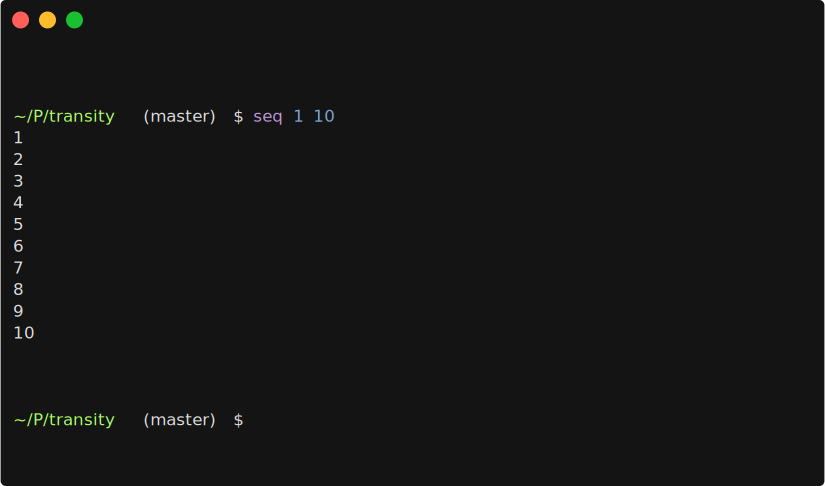

# svg-term-bug

Bug in svg-term




https://asciinema.org/a/WjieFWejN9qfjzFsyj1jzoYq0


```
svg-term \
  --no-cursor \
  --at 99999 \
  --window \
  --term iterm2 \
  --profile ../../dotfiles/terminal/adius.itermcolors \
  < bug.json \
  > bug.svg
```
